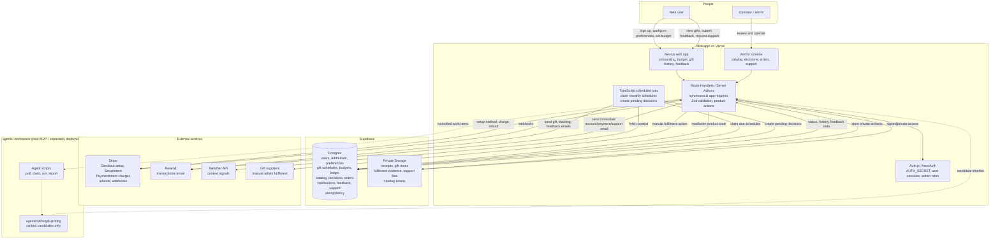

# BlinkBox MVP System Design Diagram

This diagram is intentionally written in Mermaid so it can be edited directly in Markdown or pasted into a Mermaid editor.

## Notes

- Supabase Postgres is the source of truth for product and operational state.
- Stripe stores payment methods and handles charges/refunds; BlinkBox stores only Stripe references.
- MVP uses Postgres schedule rows for monthly gift decisions; Supabase Queues are a post-MVP option.
- `blinkapp/` owns approvals, payments, orders, fulfilment state, support, and audit history.
- `agents/skills` can be deployed separately, but skills recommend only.
- `docs/` contains the editable PRD, design docs, Mermaid diagrams, and generated PNG diagrams.
- Admin actions should append auditable records instead of silently mutating history.
